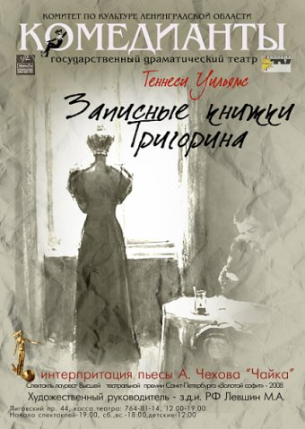

[

][0]

Казалось, совсем недавно у нас в театре состоялась премьера первой петербургской постановки пьесы Теннесси Уильямса ["Записные книжки Тригорина"][0]. И вот 10 мая театр покажет сотый одноименный спектакль з.д.и. РФ [М. Левшина][1], полюбившийся зрителям оригинальным исполнением роли Аркадиной з.а. РФ [Ниной Мещаниновой][2], тонкой психологической игрой з.а. РФ [Виктора Костецкого][3] в роли доктора Дорна (Золотой софит), удивительно светлым исполнением Светланы Сухановой (приз зрительских симпатий за роль Маши). Действие спектакля разворачивается в усадьбе, где так и не состоялась премьера новаторской пьесы Константина Треплева. Но главным героем становится не он, а писатель Тригорин ([Валерий Полетаев][4]), содержание записных книжек которого разыгрывается на сцене. «Записные книжки Тригорина» добавляют к чеховскому тексту еще один пуд иронии и полпуда цинизма.

Приглашаем Вас отметить юбилей спектакля в пятницу, **10-го мая**, в теплой компании «Комедиантов»!

6.05.2013г.

[0]: ../../performance/zapisnye-knizhki-trigorina "Записные книжки Тригорина"
[1]: ../../person/mikhail-levshin "Михаил Левшин"
[2]: ../../person/nina-meschaninova "Нина Мещанинова"
[3]: ../../person/viktor-kostetskii "Виктор Костецкий"
[4]: ../../person/valerii-poletaev "Валерий Полетаев"