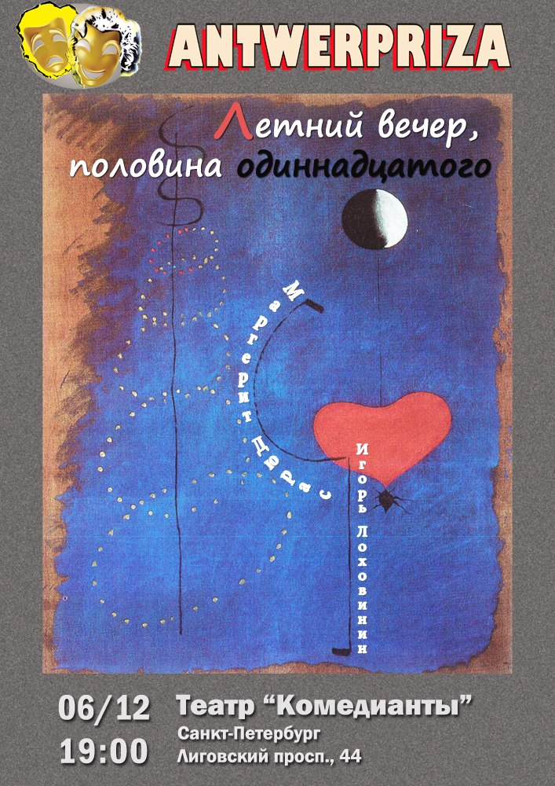
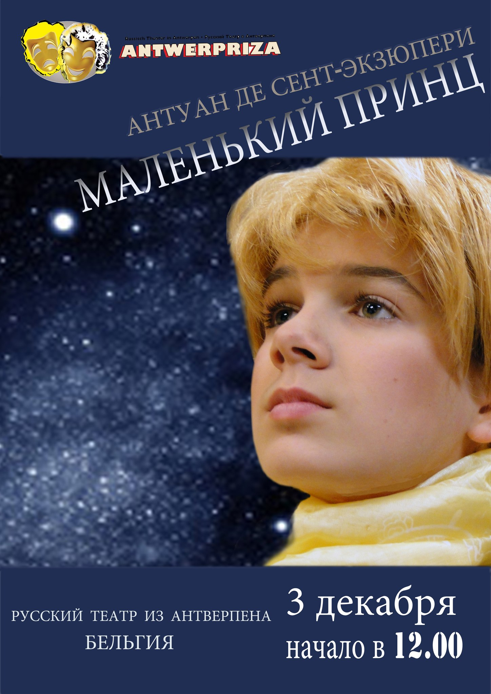

В начале декабря театр «Комедианты» принимает у себя гостей --- театральную труппу из Антверпена --- «Antverpriza».

Первым мероприятием в рамках гастрольной программы 2 декабря в 19.00 был Мастер-класс по пластике выдающегося клоуна-мима Шарля Корнетта, основателя и руководителя театра «Международная Новая Сцена» (Nouvelle scène internationale). Вместе с женой он преподавал актерское мастерство в Высшем институте драматического искусства им. Германа Тэрлинка в Антверпене. Вместе они давали мастер-классы в разных университетах в Бельгии и за рубежом --- по все Европе и даже в ЮАР. Подробнее о Шарле Корнетте, а так же видео с мастер-класса --- в нашем [журнале][0]!

3 декабря в 12.00 в рамках благотворительного фестиваля, организованного театром «Комедианты» --- «Дворцы Санкт-Петербурга --- детям», бельгийская труппа представила спектакль «Маленький принц» (А. Экзюпери) во Дворце Белосельских-Белозерских.

Спектакль для взрослых «Летний вечер, половина одиннадцатого» по бестселлеру Маргарет Дюрас для петербургского зрителя будет представлен 6-го декабря в 19.00, а в Ленинградской области, в Лодейном поле --- 4 декабря. Это спектакль о двух странах, двух традициях и двух традиционных любовных треугольниках. Восприятие сексуальной революции в разных культурах, в разных реальностях.

2.12.2013

[0]: http://journal.komedianty.com/sharl-kornett-u-komediantov/