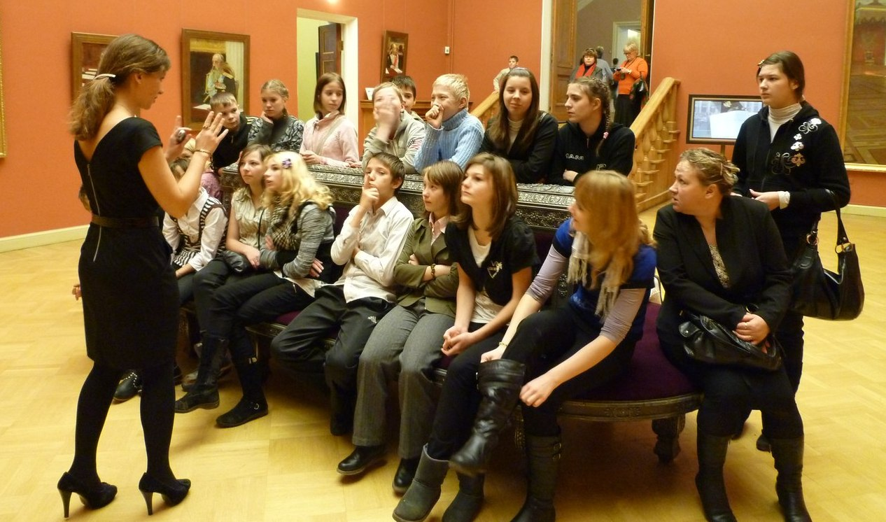

С 21 по 26 ноября на сценических площадках и в музеях города проходит очередной благотворительный театральный фестиваль

«Дворцы Санкт- Петербурга - детям».

Фестиваль проводится ежегодно, с 1991 года, по инициативе художественного руководителя театра «Комедианты», заслуженного деятеля искусств России Михаила Левшина, при поддержке Правительства Ленинградской области. Этот проект, адресованный прежде всего воспитанникам детских домов и детям из неблагополучных семей, уникален тем, что объединяет в одно целое сценическое действие и знакомство с памятниками архитектуры Петербурга. Фестивальная программа идёт на сценических площадках дворцов и музеев города. Юный зритель получает не только уникальную возможность ознакомиться с историей шедевров городской архитектуры, связанными с ними яркими страницами прошлого, но и яркие незабываемые впечатления от спектаклей. Помимо спектаклей и экскурсий в рамках проекта проводятся творческие встречи артистов со зрителями, конференции, мастер-классы. Уже 20 лет фестиваль даёт детям, попавшим в сложную жизненную ситуацию, возможность прикоснуться к прекрасному, найти новых друзей и получить положительные эмоции.

В этот раз помимо драматических и кукольных спектаклей юных зрителей ожидает интересная музыкальная программа от Петербургского Музыкального альянса. По традиции участие в фестивале примут коллективы Большого театра кукол и Театра марионеток имени Е. С. Деммени, спектакль которого пройдет в Русском музее. Зрители посетят Зоопарк, музей Г.Р. Державина и русской словесности, а в Театральном музее увидят спектакль кукольного театра «Без занавеса». Закроется фестиваль в Доме Перцова премьерным спектаклем театра «Комедианты», обладателем премии «Театры Санкт-Петербурга - детям» - [«Карлсон»][0].

20.11.2012

[0]: ../../performance/karlson "Карлсон"