## РАЗНЫЕ ФОТО

Команда театра "Комедианты" на телеИГРЕ "СТО к ОДНОМУ" (2012 г.)

Команда театра "Комедианты" на телеИГРЕ "СТО к ОДНОМУ" (2012 г.)

Екатерина Культина, Алёна Азарова, Станислав Воронецкий, Екатерина Белова и Роман Притула

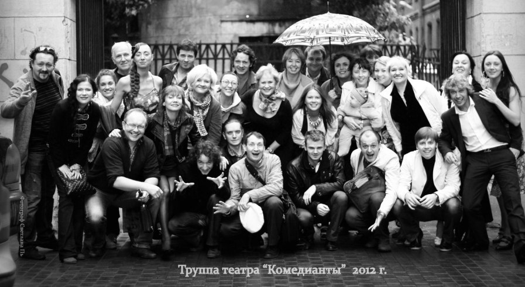

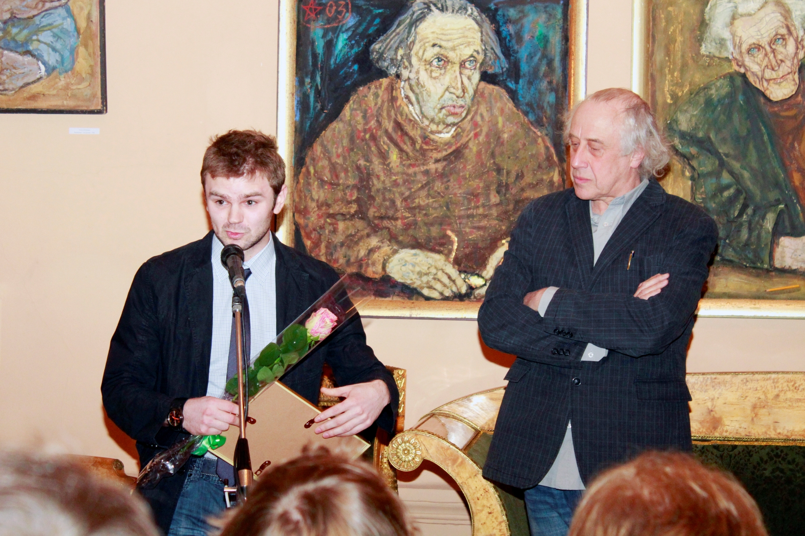

Роман Притула и Сергей Мигицко на вручении премии "Театры Санкт-Петербурга - детям" 16.04.12

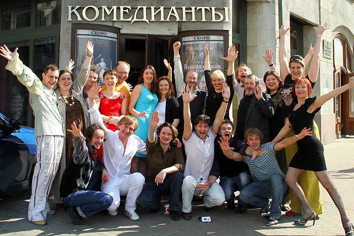

2010 год

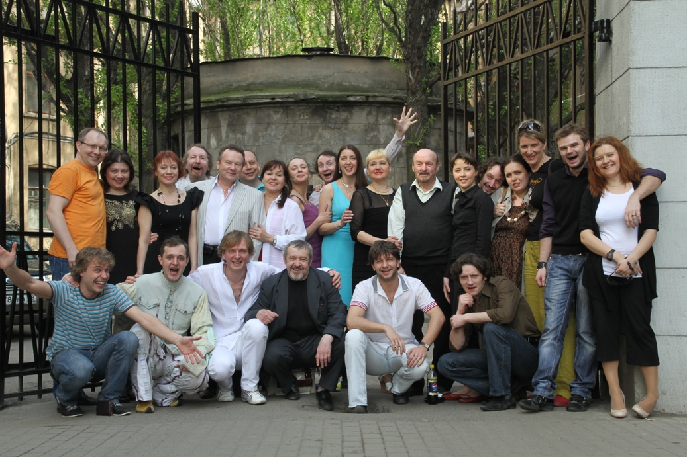

2010 год

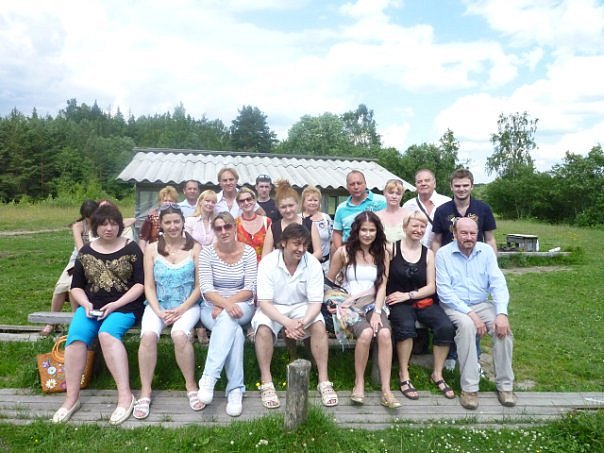

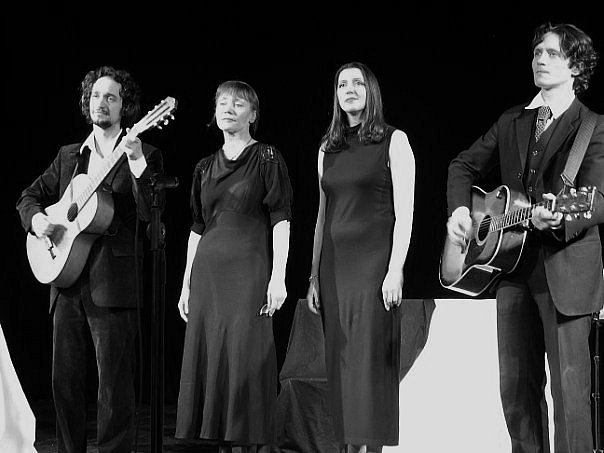

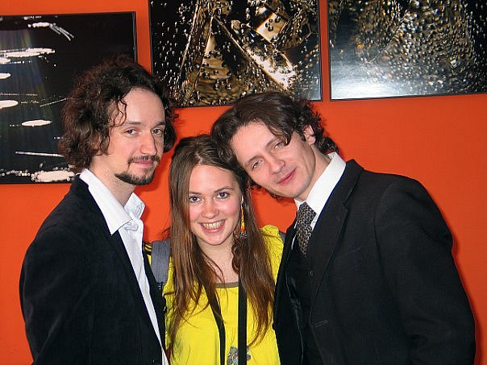

Леонид Зябкин, Борислава Шарова, Виталий Кравченко

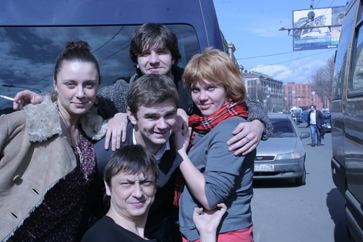

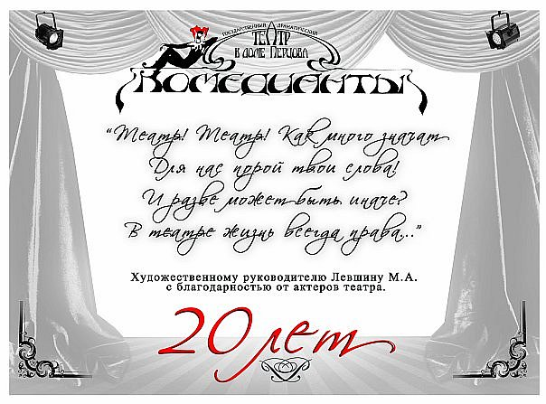

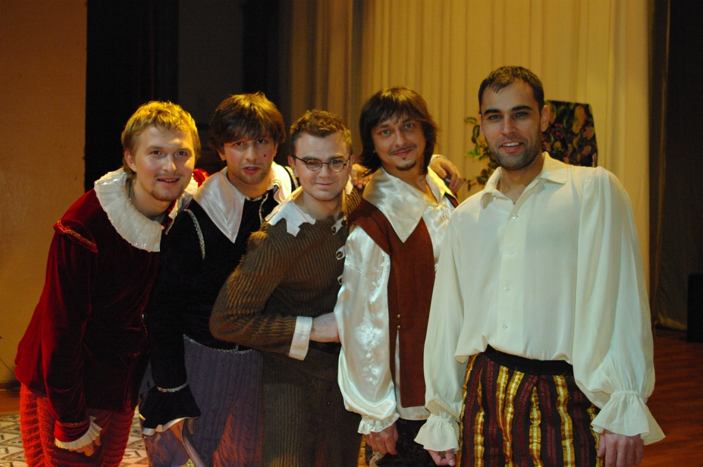

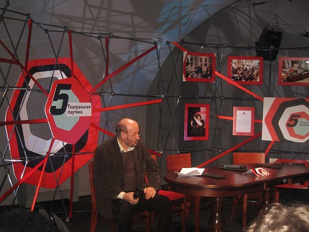

фестиваль "Театральная паутина"

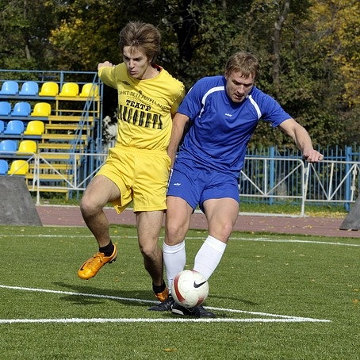

(кубок Кирилла Лаврова 2010)

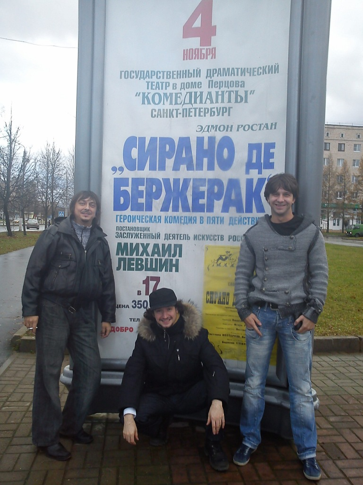

Павел Ивановский, Леонид Зябкин, Дмитрий Рудаков (г.Криши) 4 ноября 2010 г.

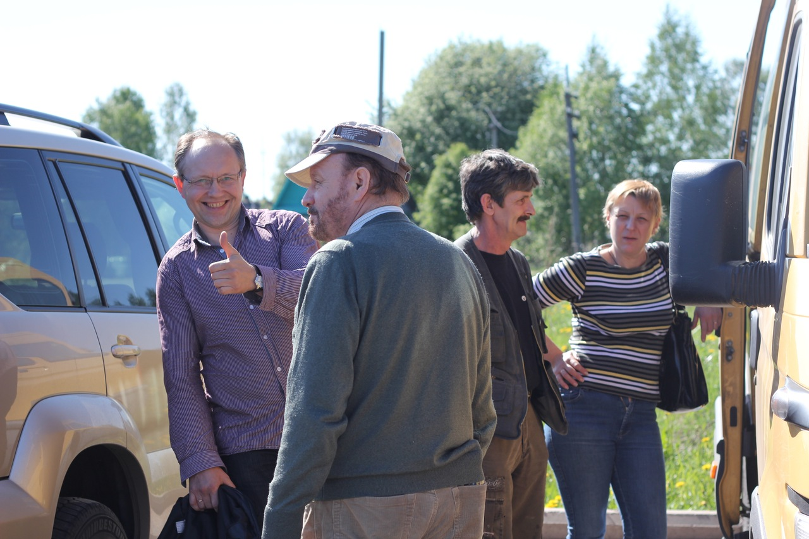

В Лодейном Поле

Спектакль "Дурочка" в городе Волосово

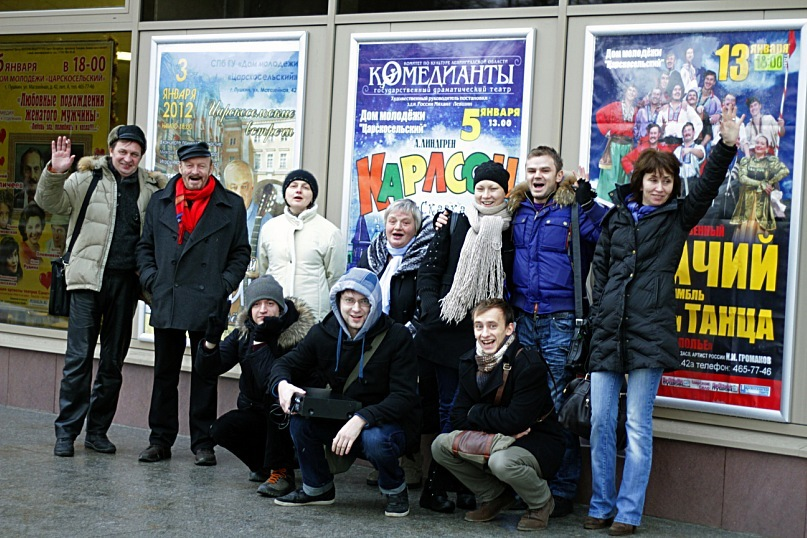

Спектакль "Карлсон" в Пушкине (5.01.2012)