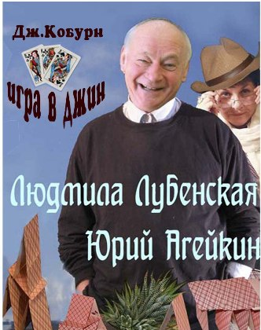

Дорогие зрители! Представляем Вам дорогих гостей нашего театра - театр "Кураж"!

17 декабря и 28 января спектакль **"ИГРА В ДЖИН"** (Д. Кобурн)

трагифарс

Режиссер-постановщик -- В. Сиваков

Трудно определить жанр спектакля -- комедия ? Трагедия ? Драма ? Фарс ?.. Пожалуй, и то, и другое, и третье, и четвертое... События разворачиваются в американском доме престарелых и , казалось бы, у героев пьесы все в прошлом -- семья, работа, друзья, любовь...Но жизнь, как хороший драматург, очень часто преподносит нам такие сюрпризы !... В спектакле заняты петербургские актеры, которых вы могли видеть и на экранах ваших телевизоров и на сценах питерских театров --Юрий Агейкин и Людмила Лубенская.

12.12.2013