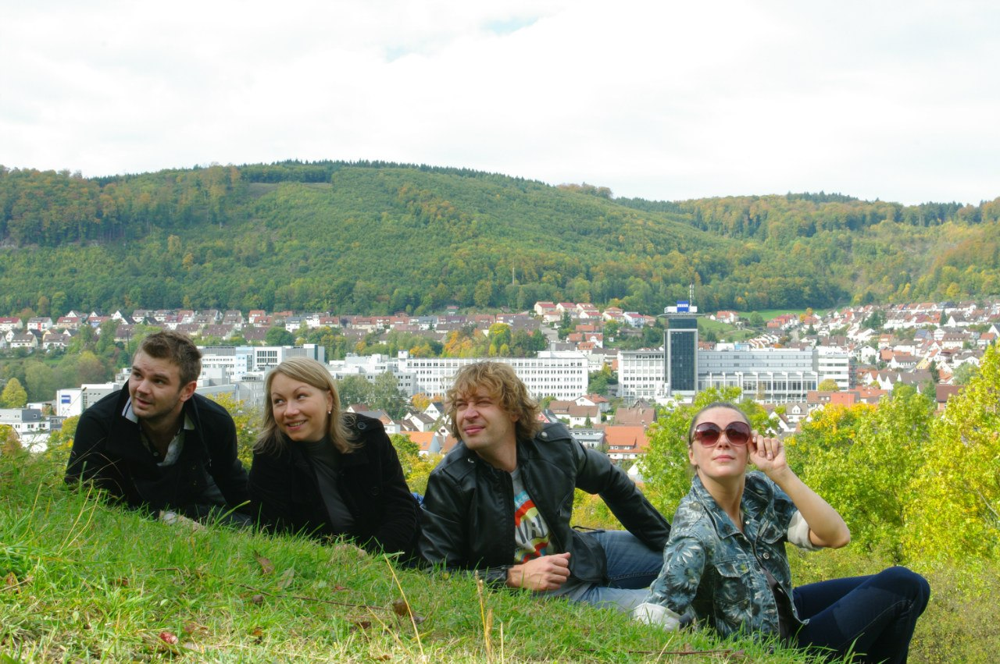

[

][0]

**6 октября** театр «Комедианты» показал спектакль [«Муму»][0] ([«Крепостная любовь»][0]) в зале мэрии города **Оберкохена**, округ Швабские Альпы, земля Баден-Вюртемберг, **Германия**. Несмотря на то, что сцена была не приспособлена для показала театральных спектаклей, готовность актеров, сотрудников театра и местной администрации в лице ответсвенного по культуре господина Хирта к кооперации помогла преодолеть все трудности.

«Спектакль произвел на немецких и русских жителей Оберкохена и окрестностей огромное впечатление, талантливая игра актеров вызвала глубокий отклик в сердцах зрителей, многие их которых не понимали русский язык. Местная пресса дала прекрасные отзывы о спектакле, а зрители надеются, что такой первоклассный театр обязательно посетит их еще не раз» — Виктория Рипенхаузен, жительница Оберкохена.

[

][1]

[

][1]

[ФОТО С ГАСТРОЛЕЙ В ГЕРМАНИЮ][1]

12.10.12

[0]: ../../performance/krepostnaya-lyubov-mumu "Крепостная любовь (Муму)"
[1]: ../fotootchyot-s-gastrolei-v-germaniyu-g-oberkokhen "Фотоотчёт с гастролей в Германию (г. Оберкохен)"