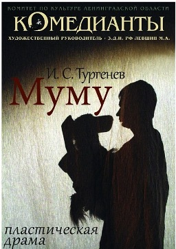

**21 октября** театр Комедианты показал пластическую драму[«МУМУ»][0] по повести И. Тургенева для норвежских зрителей в **Национальном театре г.Осло (Норвегия)**. Так же для юных зрителей Осло был представлен спектакль [«Ехала деревня мимо мужика»][1].

[

][2]

[

][2]

[ФОТО С ГАСТРОЛЕЙ В НОРВЕГИЮ][2]

25.10.2011

[0]: ../../performance/krepostnaya-lyubov-mumu "Крепостная любовь (Муму)"
[1]: ../../performance/ekhala-derevnya-mimo-muzhika "Ехала деревня мимо мужика"
[2]: ../fotootchyot-s-gastrolei-v-norvegiyu-g-oslo "Фотоотчёт с гастролей в Норвегию (г. Осло)"