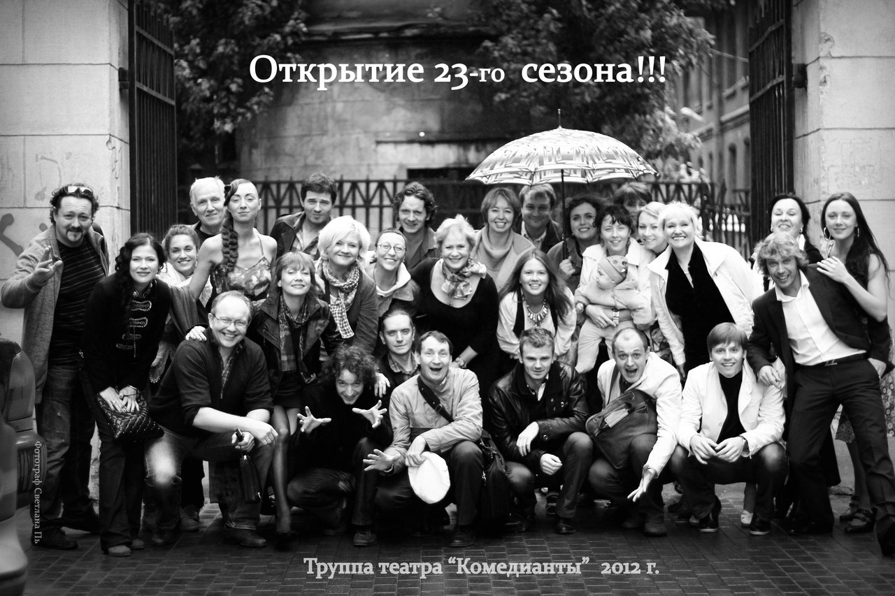

Зрители смогут насладиться спектаклем в обновленных интерьерах, посетить новое кафе в уютном бельэтаже. Новые удобные кресла, новая сцена, инсталляция, посвященная двадцатидвухлетней истории театра -- все это ожидает Вас в театре «Комедианты» в новом сезоне. И, конечно, новые спектакли!

Первый -- музыкальный спектакль [«Лес»][0]. Это своеобразный эксперимент, но подробности пока хочется оставить в секрете. Автор музыки к спектаклю - советский и российский композитор, лауреат Государственной премии СССР, Владимир Дашкевич, а автор либретто -- известный актёр, сценарист и поэт Вадим Жук. В процессе создания спектакля шел очень непростой и длительный кастинг. В итоге в спектакле заняты актеры нашего театра - з.а. России [Нина Мещанинова][1], з.а. России [Геннадий Спириденков][2], [Максим Сергеев][3], [Сергей Николаев][4], [Юлия Бурцева][5], [Татьяна Кожевникова][6], [Виталий Кравченко][7], [Ильгиз Булгаков][8], [Леонид Зябкин][9] и три приглашенных актера -- Андрей Шимко, Юрий Агейкин и Андрей Вергелис (выпускник Ю.Г. Фельштинского). Режиссер спектакля -- художественный руководитель театра «Комедианты» з.д.и. России [Михаил Левшин][10]. Вторая премьера -- спектакль молодого, уже заслужившего признание, петербургского режиссера Глеба Володина по пьесе Григория Горина [«Поминальная молитва»][11]. По сути, эта пьеса -- философская притча, а по жанру - смех сквозь слезы.

Помимо этого в театре идут репетиции спектакля [«Фарсы»][12] (популярный жанр средневековой драмы). Этот проект для нас долгожданный, потому что он близок нашему театру по своей концепции -- жанру народного представления, где идет активное общение с залом, где сама драматургия содержит здоровый народный юмор. Наш первый спектакль [«Страсти по-итальянски»][13] таков. Продолжают эту добрую традицию спектакли [«Не всякий вор - грабитель»][14], водевиль [«Беда от нежного сердца][15]». Ставит спектакль режиссер [Алексей Исполатов][16], последняя работа которого в нашем театре --[«Училка из будущего»][17] получила в прошлом сезоне премию «Театры Санкт-Петербурга - детям». Еще один проект -- «Марлен, рожденная для любви», спектакль-концерт, посвященный жизни и творчеству Марлен Дитрих. И есть еще спектакль, находящийся на стадии задумки -- инсценировка повести Сергея Довлатова «Компромисс». Мы с нетерпением ждем Вас, наши дорогие зрители... До встречи!

[0]: ../../performance/les "Лес"
[1]: ../../person/nina-meschaninova "Нина Мещанинова"
[2]: ../../person/gennadii-spiridenkov "Геннадий Спириденков"
[3]: ../../person/maksim-sergeev "Максим Сергеев"
[4]: ../../person/sergei-nikolaev "Сергей Николаев"
[5]: ../../person/yuliya-burtseva "Юлия Бурцева"
[6]: ../../person/tatyana-kozhevnikova "Татьяна Кожевникова"
[7]: ../../person/vitalii-kravchenko "Виталий Кравченко"
[8]: ../../person/ilgiz-bulgakov "Ильгиз Булгаков"
[9]: ../../person/leonid-zyabkin "Леонид Зябкин"
[10]: ../../person/mikhail-levshin "Михаил Левшин"
[11]: ../../performance/pominalnaya-molitva "Поминальная молитва"
[12]: ../../performance/farsy "Фарсы"
[13]: ../../performance/strasti-po-italyanski "Страсти по-итальянски"
[14]: ../../performance/ne-vsyakii-vor-grabitel "Не всякий вор — грабитель"
[15]: ../../performance/beda-ot-nezhnogo-serdtsa "Беда от нежного сердца"
[16]: ../../person/aleksei-ispolatov "Алексей Исполатов"
[17]: ../../performance/uchilka-iz-buduschego "Училка из будущего"