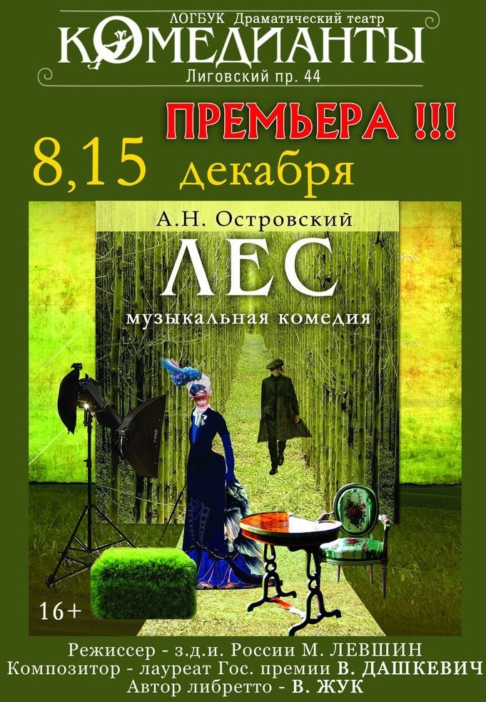

## Драматический театр «КОМЕДИАНТЫ»

**ПЕРВАЯ ПРЕМЬЕРА В НОВЫХ ИНТЕРЬЕРАХ!**

**Состоялась 8 и 15 декабря**

**А.Н.Островский**

**«ЛЕС»**

**+16**

Постановщик - заслуженный деятель искусствт РФ Михаил ЛЕВШИН.

Автор музыки - советский и российский композитор , лауреат Государственной премии СССР Владимир ДАШКЕВИЧ.

Автор текста песен - сценарист и поэт Вадим ЖУК.

Художник - постановщик - Полина ЛЕВШИНА.

**_В добрых традициях театра «Комедианты» на сцене снова живая классика!_**

«Лес» А. Н. Островского -- очень благодарный материал для театра, ведь это пьеса об актерах, о комедиантах. Причем свой спектакль играют все персонажи пьесы. Помещица Гурмыжская обожает устраивать у себя в имении концерты и музыкальные вечера, где она -- примадонна. Здесь она поет, играет и предстает перед своими гостями в главной в своей жизни роли -- роли великой благодетельницы.

Все герои в маленьком мирке усадьбы «Пеньки» не живут, а красуются, изображают, строят и поддерживают свое реноме. Это мир, где все чувства и поступки -- напоказ, а такие понятия, как благородство и бескорыстие - красивы, театральны, но непременно скрывают под собой корысть и расчет. Ведь и примадонна, и все герои спектакля, буквально, живут, страдают и обретают счастье под слепящим светом софитов, вспышки фотоаппаратов, как будто бы под постоянным пристальным взглядом объектива видеокамеры.

В этом концертно-показном безумии воспитывается юная и чистая племянница Гурмыжской Аксюша и молодой нищий дворянин Буланов. Сюда же попадает племянник помещицы -- актер Несчастливцев. Его трагическое благородство заставит действие привычно-фарсового спектакля обитателей именья «Пеньки» придти к неожиданному финалу.

В спектакле заняты : з.а. России [Нина Мещанинова][0], з.а. России[Геннадий Спириденков][1], [Юлия Бурцева][2], Андрей Вергелис, Андрей Шимко, [Сергей Николаев][3], [Максим Сергеев][4], [Виталий Кравченко][5], Юрий Агейкин, [Татьяна Кожевникова][6], [Ильгиз Булгаков][7], [Леонид Зябкин][8].

Продолжительность спектакля 3 часа 20 минут.

15.12.2012

[0]: ../../person/nina-meschaninova "Нина Мещанинова"
[1]: ../../person/gennadii-spiridenkov "Геннадий Спириденков"
[2]: ../../person/yuliya-burtseva "Юлия Бурцева"
[3]: ../../person/sergei-nikolaev "Сергей Николаев"
[4]: ../../person/maksim-sergeev "Максим Сергеев"
[5]: ../../person/vitalii-kravchenko "Виталий Кравченко"
[6]: ../../person/tatyana-kozhevnikova "Татьяна Кожевникова"
[7]: ../../person/ilgiz-bulgakov "Ильгиз Булгаков"
[8]: ../../person/leonid-zyabkin "Леонид Зябкин"