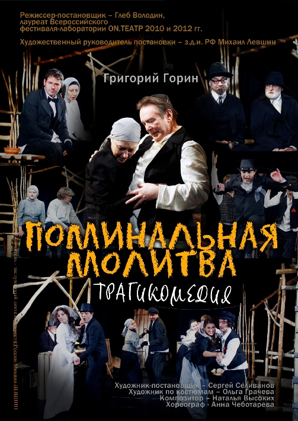

## 23 и 24 февраля в 18.00

**«ПОМИНАЛЬНАЯ МОЛИТВА»**

**Григорий Горин**

_Трагикомедия_

Режиссер-постановщик — Глеб ВОЛОДИН,

лауреат Всероссийского фестиваля-лаборатории ON.ТЕАТР 2010 и 2012 гг.

Худ. руководитель постановки — Заслуженный деятель искусств РФ [Михаил ЛЕВШИН][0]

Художник-постановщик — Сергей СЕЛИВАНОВ

Художник по костюмам — Ольга ГРАЧЁВА

Композитор — Наталья ВЫСОКИХ

Хореограф - Анна ЧЕБОТАРЁВА

1903-1906 годы. Тревожное для России время — русско-японская война, революция, принятие конституции, еврейские погромы, в воздухе витают новые идеи. Но не эти проблемы волнуют молочника Тевье-Тевля из украинской деревушки Анатовка.

Ему трех старших дочерей пора выдавать замуж. А дочери с характером, не хотят следовать вековым традициям — подчиниться выбору отца. Хотят замуж по любви выйти. Нелегко будет принять мудрому Тевье то, что одна его дочь вместо богача выберет бедняка, вторая — революционера, а третья полюбит русского — вопреки вере и традициям. Привычный уютный и знакомый мир рушится на глазах. И нужно сделать выбор — принять эту новую странную меняющуюся действительность или. На помощь героям приходит любовь и юмор, любовь всепрощающая и юмор печальный, но спасительный. Грусть и веселье идут рука об руку — и в понимание этого рождается истинная мудрость. «Все смеются и плачут» — так заканчивается пьеса Григория Горина, признанная его лучшим драматическим произведением. «Поминальная молитва» написана по повести «Тевье-Молочник» Шолом-Алейхема, еврейского классика, одного из родоначальников литературы на языке идиш.

В спектакле заняты: [Валерий ПОЛЕТАЕВ][1], [Людмила НИКИТИНА][2], [Юлия ГОРШЕНИНА][3] / Наталья БОЯРЁНОК, [Алена АЗАРОВА][4], Светлана СУХАНОВА, [Роман ЯКУШОВ][6], [Леонид ЗЯБКИН][7], [Марк ГАВРИЛОВ][8], Кирилл ДАТЕШИДЗЕ, [Станислав ВОРОНЕЦКИЙ][9], [Ильгиз БУЛГАКОВ][10], [Николай ИСПОЛАТОВ][11], [Виталий КРАВЧЕНКО][12], [Александр ШЕВЕЛЁВ][13], [Галина САБУРОВА][14], [Илья БЕЗРУК][15],[Елизавета ЧЕРНОВА][16].

Продолжительность спектакля — 3 часа 30 минут

30.01.2013

[0]: ../../person/mikhail-levshin "Михаил Левшин"
[1]: ../../person/valerii-poletaev "Валерий Полетаев"
[2]: ../../person/lyudmila-nikitina "Людмила Никитина"
[3]: ../../person/yuliya-gorshenina "Юлия Горшенина"
[4]: ../../person/alyona-azarova "Алёна Азарова"
[6]: ../../person/roman-yakushov "Роман Якушов"
[7]: ../../person/leonid-zyabkin "Леонид Зябкин"
[8]: ../../person/mark-gavrilov "Марк Гаврилов"
[9]: ../../person/stanislav-voronetskii "Станислав Воронецкий"
[10]: ../../person/ilgiz-bulgakov "Ильгиз Булгаков"
[11]: ../../person/nikolai-ispolatov "Николай Исполатов"
[12]: ../../person/vitalii-kravchenko "Виталий Кравченко"
[13]: ../../person/aleksandr-shevelyov "Александр Шевелёв"
[14]: ../../person/galina-saburova "Галина Сабурова"
[15]: ../../person/ilya-bezruk "Илья Безрук"
[16]: ../../person/elizaveta-chernova "Елизавета Чернова"