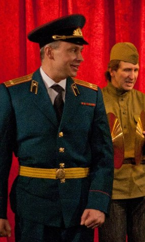
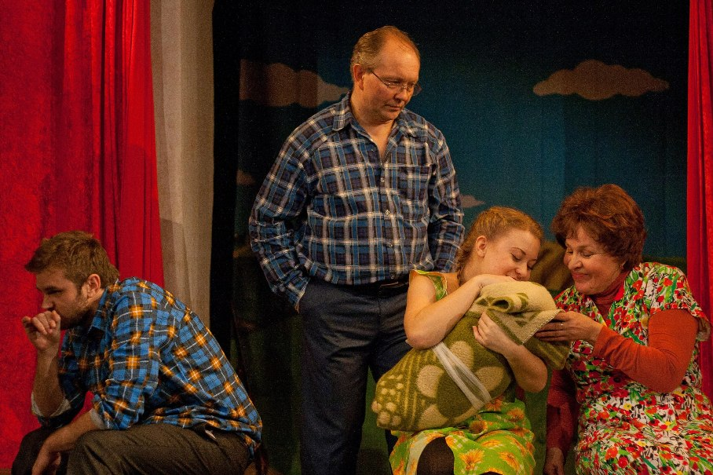

## 27 и 29 марта - ПРЕМЬЕРА!!!

[**«ЗЕМЛЯКИ»**][0]

лирическая комедия

по рассказам Василия Шукшина

Режиссёр-постановщик - з.д.и. России [Михаил ЛЕВШИН][1]

Художник-постановщик - Мария Смирнова-Несвицкая

Музыкальное оформление - Вера Трошнева

«В рассказах Шукшина гармонично сочетаются три потока —

драматизма, юмора и нежности».

С. Юрский

Приглашаем Вас совершить путешествие в настоящую русскую глубинку 60-х годов ХХ века. На время спектакля сцена и зрительный зал превратятся в сельский клуб, где проходит смотр художественной самодеятельности. Участники, наши «земляки», продемонстрируют свои разносторонние таланты.

Песня испокон веков сопровождает русского человека - и в печали, и в радости. В спектакле песни в исполнении односельчан превращаются в реальные истории — от Ивана Петина жена ушла, да не просто ушла, а сбежала с офицером, а в семье Худяковых родился младенец без отца, а Венька Зяблицкий, тот вообще тещу в туалете заколотил. И каждая такая история оборачивается исповедью. Недаром у русского человека издавна «душа болит». И снова рождается песня, а с ней и веселье, и покой, и сама жизнь.

«Земляки» - это спектакль про нас, про русских людей, которым горе не беда, а печаль в радость. Это спектакль про нашу страну, огромную, прекрасную и непостижимую.

В спектакле используются песни советской эстрады.

В ролях: [Заслуженный артист России Геннадий Спириденков][2], [Алена Азарова][3], [Екатерина Белова][4], [Татьяна Кожевникова][5], [Ирина Митюшкина][6], [Анастасия Пижель][7], [Елизавета Чернова][8], [Ольга Яковлева][9], [Илья Безрук][10], [Сергей Бледных][11], Александр Гончарук, [Анатолий Ильченко][12], [Виталий Кравченко][13], Виталий Такс, [Роман Притула][14], [Евгений Талашманов][15] , Юрий Агейкин.

Фото Анны Захаровой

7.02.2014

[0]: ../../performance/zemlyaki "Земляки"
[1]: ../../person/mikhail-levshin "Михаил Левшин"
[2]: ../../person/gennadii-spiridenkov "Геннадий Спириденков"
[3]: ../../person/alyona-azarova "Алёна Азарова"
[4]: ../../person/ekaterina-belova "Екатерина Белова"
[5]: ../../person/tatyana-kozhevnikova "Татьяна Кожевникова"
[6]: ../../person/irina-mityushkina "Ирина Митюшкина"
[7]: ../../person/anastasiya-pizhel "Анастасия Пижель"
[8]: ../../person/elizaveta-chernova "Елизавета Чернова"
[9]: ../../person/olga-yakovleva "Ольга Яковлева"
[10]: ../../person/ilya-bezruk "Илья Безрук"
[11]: ../../person/sergei-blednykh "Сергей Бледных"
[12]: ../../person/anatolii-ilchenko "Анатолий Ильченко"
[13]: ../../person/vitalii-kravchenko "Виталий Кравченко"
[14]: ../../person/roman-pritula "Роман Притула"
[15]: ../../person/evgenii-talashmanov "Евгений Талашманов"