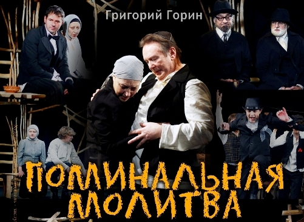

## ПРЕССА

**"Поминальная молитва"**

читаем

["Вот так--без помпы,без ласки критиков -- в скромном театре происходят действительно масштабные истории" о спектакле "Поминальная молитва" (газета "Невское время")(Автор:Е.Добрякова)][0]

[Интервью режиссёра спектакля "Поминальная молитва" Глеба Володина - "Жизнь идёт дальше, и, чтобы ни случилось, продолжать её лучше с улыбкой на лице... " (Студенческая газета "Gaudeamus")(Автор:Л.Шафранская)][1]

["О жизни которая добрее и мудрее нас.." о спектакле "Поминальная молитва" (Петербургский Театральный Журнал)(Автор: Е.Омецинская)][2]

["Вместе мы не пропадём или "Поминальная молитва" Г.Горина" (Арт-журнал "Okolo.me")(автор:Е.Приклонская)][3]

[Рецензия Елены Добряковой о премьерном спектакле "Поминальная молитва" Г.Горин][4]

[

][5]

12.03.2013г.

[0]: ../../press/o-spektakle-pominalnaya-molitva "О спектакле «Поминальная молитва»"
[1]: ../../press/intervyu-gleba-volodina-o-spektakle-pominalnaya-molitva "Интервью Глеба Володина о спектакле Поминальная молитва"
[2]: ../../press/o-zhizni-kotoraya-dobree-i-mudree-nas "О жизни, которая добрее и мудрее нас"
[3]: ../../press/vmeste-my-ne-propadyom-ili-pominalnaya-molitva-g-gorina "Вместе мы не пропадём или «Поминальная молитва» Г. Горина"
[4]: ../../press/retsenziya-eleny-dobryakovoi-o-premernom-spektakle-pominalnaya-molitva "Рецензия Елены Добряковой о премьерном спектакле «Поминальная молитва»"
[5]: ../../performance/pominalnaya-molitva "Поминальная молитва"