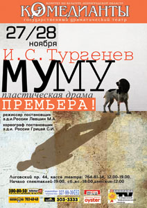

\*\*

[

][0]

Театр «КОМЕДИАНТЫ» представляет 27 и 28 ноября в 18.00 ПРЕМЬЕРА! И. Тургенев ["МуМу"][0] Пластическая драма.\*\*

\_Режиссер -- постановщик з.д.и. России М. А. Левшин

Хореограф-постановщик з.д.и. России С.И. Грицай\_

Известная всем с детства повесть предстанет в спектакле театра чередой пластических этюдов на фоне художественной инсталляции картин русских художников; музыкальным фоном спектакля режиссер избрал русский народный фольклор. «Немногословность» русского мужика, тяжело и много трудящегося, уходит корнями в сам уклад жизни крестьянской России, формировавшийся веками. Отсюда выбор жанра -- «пластическая драма». Спектакль театра «Комедианты» практически без слов. В глухоту и немоту погружаются все обитатели усадьбы, и немота Герасима оказывается самой звенящей и пронзительной. Повесть о печальной судьбе двух одиноких существ -- мужика и собаки, в постановке М. А. Левшина, наполнена простым человеческим сопереживанием и грустью. Оригинальная трактовка сочетает в себе современный пластические формы и самобытность и очарование народного фольклора. В спектакле заняты: **[Филипп Азаров][1], [Алена Киверская][2], [Анатолий Ильченко][3], [Екатерина Белова][4], [Юлия Бурцева][5], [Лариса Климова][6], [Людмила Никитина][7], [Анастасия Пижель][8], [Ольга Яковлева][9], [Сергей Бледных][10], [Роман Притула][11], [Станислав Воронецкий][12], [Виталий Кравченко][13], [][14]Дмитрий Рудаков.**

20.10.2010

[0]: ../../performance/krepostnaya-lyubov-mumu "Крепостная любовь (Муму)"
[1]: ../../person/filipp-azarov "Филипп Азаров"
[2]: ../../person/alyona-azarova "Алёна Азарова"
[3]: ../../person/anatolii-ilchenko "Анатолий Ильченко"
[4]: ../../person/ekaterina-belova "Екатерина Белова"
[5]: ../../person/yuliya-burtseva "Юлия Бурцева"
[6]: ../../person/larisa-klimova "Лариса Климова"
[7]: ../../person/lyudmila-nikitina "Людмила Никитина"
[8]: ../../person/anastasiya-pizhel "Анастасия Пижель"
[9]: ../../person/olga-yakovleva "Ольга Яковлева"
[10]: ../../person/sergei-blednykh "Сергей Бледных"
[11]: ../../person/roman-pritula "Роман Притула"
[12]: ../../person/stanislav-voronetskii "Станислав Воронецкий"
[13]: ../../person/vitalii-kravchenko "Виталий Кравченко"
[14]: ../../person/ilya-bezruk "Илья Безрук"