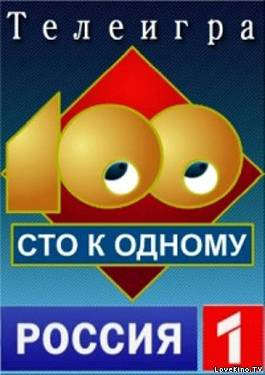
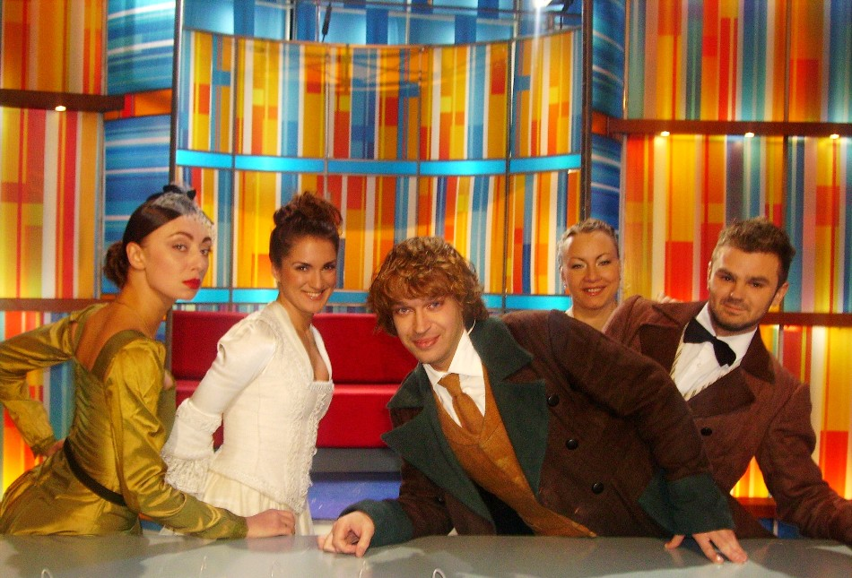
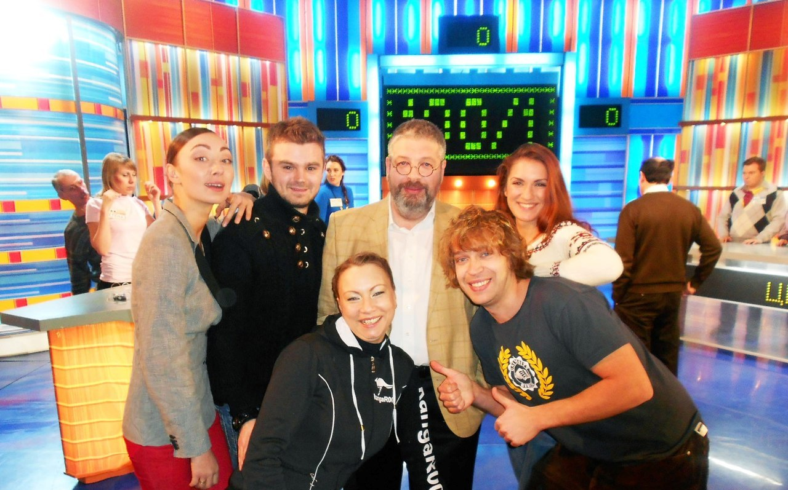

[

][0]

**29 ноября** в Москве команда театра «КОМЕДИАНТЫ» участвовала в записи телевизионной игры «СТО к ОДНОМУ». Команда состояла из пяти актеров театра -- [Станислав ВОРОНЕЦКИЙ][1], [Екатерина БЕЛОВА][2], [Роман ПРИТУЛА][3], [Алена АЗАРОВА][4] и [Екатерина КУЛЬТИНА][5]. «Комедианты» вернулись с победой! Поздравляем участников и с нетерпением ждем эфира на [телеканале][6][**«Россия»**][6]. Приблизительно эфир запланирован на **12 мая 2013 г.** !Следите за новостями!

30.11.2012

[0]: http://russia.tv/brand/show/brand_id/9222
[1]: ../../person/stanislav-voronetskii "Станислав Воронецкий"
[2]: ../../person/ekaterina-belova "Екатерина Белова"
[3]: ../../person/roman-pritula "Роман Притула"
[4]: ../../person/alyona-azarova "Алёна Азарова"
[5]: ../../person/ekaterina-kultina "Екатерина Культина"
[6]: http://russia.tv/