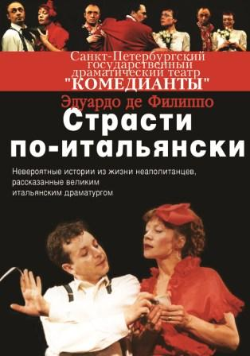

## БРАВО , "КОМЕДИАНТЫ"!
Недавно Санкт-Петербургский областной драматический театр «Комедианты» отпраздновал свое 20-летие. В рамках юбилейных торжеств прошла неделя бенефисов, звездами которой стали ведущие артисты театра.

[**Максим Сергеев**][0] блеснул в комедии Эдуардо де Филиппо [«Страсти по-итальянски»][1], режиссер и актер [**Алексей Исполатов**][2] -- в [«Волках и овцах»][3] А. Островского, [**Валерий Полетаев**][4] -- в гоголевской [«Женитьбе»][5], **Вадим Прохоров** -- в премьерном спектакле [«Прогулка в Лю-Бле»][6], а завершил неделю бенефис заслуженной артистки России [**Нины Мещаниновой**][7] в спектакле [«Записные книжки Тригорина»][8] по пьесе Т. Уильямса.

История «Комедиантов» началась на излете 1980-х, когда в Молодежном центре Ленин¬ского района собралась актерская труппа из шести человек под руководством **Михаила Левшина**. Их театральным дебютом стала комедия классика итальянской драматургии Эдуардо де Филиппо «Страсти по-итальянски». Спектакль состоял из трех маленьких пьес, которые разыгрывали перед зрителями бродячие комедианты. Молодой задор, юмор, обаяние и растущее мастерство юных артистов быстро покорили зрителей. Так в 1989 году в Санкт-Петербурге появился новый драматический театр «Комедианты». Сначала у труппы не было своего дома. Но через четыре года «Комедианты» обосновались в известном доме Перцова на Лиговском проспекте.

--- Пусть наш зал невелик -- всего сто мест, -- говорят о театре его обитатели, -- но именно это дает нам возможность быть ближе к тем, для кого мы создали театр, -- к нашим зрителям. В камерном театре на

первый план выдвигаются актерская индивидуальность, искусство переживания, и каждое произведение звучит здесь по-особому искренне.

Творческий эксперимент -- привычная форма существования театра. Так, последняя премьера, [«Прогулка в Лю-Бле»][6] по пьесе молодого драматурга **Е. Рубиной**, прошла в форме открытой репетиции. Создатели спектакля дали зрителю возможность принять участие в творческом процессе. В афише театра много музыкальных постановок, а одна из премьер этого сезона -- серия пластических этюдов. Музыкальным фоном спектакля станут русские народные песни в исполнении артистов театра.

Именно «Комедианты», между прочим, основали традицию благотворительного фестиваля _«Дворцы Санкт-Петербурга -- детям»_. Уже на протяжении 18 лет каждую осень они играют спектакли для детей-сирот в знаменитых особняках северной столицы, используя их интерьер как естественную декорацию. Театр много гастролирует, его постановки не раз получали престижные профессиональные премии. И в двадцатом, юбилейном, сезоне в репертуаре «Комедиантов» числятся 20 спектаклей, способных заинтересовать зрителей всех возрастов и вкусов. Ведь два десятилетия для театра -- это возраст зрелости.

_Татьяна МАЙСКАЯ_

Петербургский дневник №7 (271) / 01.03.2010 /автор: Татьяна Майская

[0]: ../../person/maksim-sergeev "Максим Сергеев"
[1]: ../../performance/strasti-po-italyanski "Страсти по-итальянски"
[2]: ../../person/aleksei-ispolatov "Алексей Исполатов"
[3]: ../../performance/volki-i-ovtsy "Волки и овцы"
[4]: ../../person/valerii-poletaev "Валерий Полетаев"
[5]: ../../performance/zhenitba "Женитьба"
[6]: ../../performance/progulka-v-lyu-blyo "Прогулка в Лю-Блё"
[7]: ../../person/nina-meschaninova "Нина Мещанинова"
[8]: ../../performance/zapisnye-knizhki-trigorina "Записные книжки Тригорина"