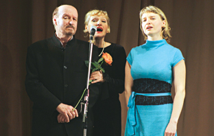
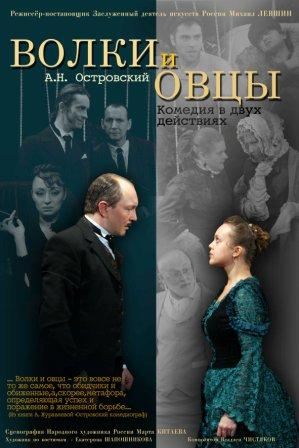

_14 марта на сцене Дома актера состоялся творческий вечер з.д.и. России художественного руководителя Санкт-Петербургского драматического театра «Комедианты» Михаила Левшина. Не юбилейный вечер, хотя хочется отметить, что в позапрошлом году театру Михаила Александровича исполнилось 20 лет, а сам он отпраздновал свой семидесятилетний юбилей в прошлом._

Вечер, не привязанный ни к премьере, ни к фестивалю -- так приятно завести разговор просто так -- ни о чем конкретном, но обо всем на свете. Получился свободный диалог со зрителями в форме вопрос-ответ, разбавленный любимыми и несправедливо позабытыми песнями-историями Галича («В свое время мы думали, что именно Галич останется в истории и станет народным, мы считали, что он острее, социальнее Высоцкого» --- М. Левшин). И, что отметили многие зрители, вечер прошел по-семейному тепло и душевно, «как будто мы зашли в гости к старым друзьям» (зритель).

Вместе с [Михаилом Левшиным][0] в концертной части программы участвовала спутница жизни режиссера, [з.а. России Нина Мещанинова][1], известная исполнительница романсов и бардовской песни, и его дочь -- Полина Левшина, художник, автор оформления спектакля «Комедиантов» [«Прогулка в Лю-Бле»][2] и спектакля «Лес», репетиции которого сейчас в самом разгаре. Вместе они спели песню «Думы потаенные» Ю. Кима, которую эта необыкновенная творческая семья, по словам самой юной участницы программы Полины, «исполняет вместе, сколько она себя помнит».

Театр-дом -- это явление было распространено в Санкт-Петербурге, но сегодня, к сожалению, все больше теряет свою актуальность. А «Комедианты» именно такой «Дом» -- для его артистов, для постоянных зрителей, небольшой и уютный, со своими страстями «по-итальянски»

[

][3]

и бедами «от нежного сердца». «Как вы воспитываете своих птенцов?» -- прозвучал вопрос в зрительном зале. Режиссер ответил, что «актеры -- это те же дети, в первую очередь их нужно очень любить, а только во вторую наказывать».

Михаил Левшин рассказал зрителям о нелегком, но полном смешных курьезных историй, пути появления театра «Комедианты» на театральной карте Петербурга. Рассказал об уникальной особенности -- жизнеспособности спектаклей театра. Феномен того, что первые спектакли театра [«Страсти по-итальянски»][4], [«Волки и овцы»][3], [«Сирано де Бержерак»][5] и др. до сих пор с успехом идут в репертуаре, режиссер объяснил наполненностью каждого образа и действия в постановке, которая достигается огромным трудом -- спектакли репетируются по году, а в рекордном случае (спектакль [«Муму»][6]) и два года. Но если решение каждого движения, каждой реплики найдено -- тогда роль можно передавать новым актерам, и они смогут легко «ввестись» и повести спектакль дальше без ущерба для его качества.

В финале Михаил Левшин рассказал зрителям о своих задумках, связанных со спектаклем по пьесе А.Н. Островского «Лес», премьера которого состоится в следующем сезоне. Это будет необычный музыкальный спектакль, музыку для которого уже написал замечательный композитор, известный зрителям по фильмам «Шерлок Холмс» и «Бумбараш» В. Дашкевич, а слова -- актер, сценарист и поэт Вадим Жук.

Форма творческого вечера -- встречи с интересными людьми -- это та замечательная традиция, которую возрождает для своих

[

][6]

участников Санкт-Петербургское зрительское общество **«Театрал»**. Помимо таких творческих вечеров общество «Театрал» организует свою зрительскую театральную премию, которая вручается в Доме актера каждый год. Последняя премьера театра «Комедианты» -- пластическая драма «Муму» по повести И. С. Тургенева [«Муму»][6] удостоилась этой премии в номинации «Лучший спектакль года».

_Борислава ШАРОВА_

газета "ВЕСТИ" / 20.03.12 / автор:Б.Шарова

[Ссылка на статью][7]

[0]: ../../person/mikhail-levshin "Михаил Левшин"
[1]: ../../person/nina-meschaninova "Нина Мещанинова"
[2]: ../../performance/progulka-v-lyu-blyo "Прогулка в Лю-Блё"
[3]: ../../performance/volki-i-ovtsy "Волки и овцы"
[4]: ../../performance/strasti-po-italyanski "Страсти по-итальянски"
[5]: ../../performance/sirano-de-berzherak "Сирано де Бержерак"
[6]: ../../performance/krepostnaya-lyubov-mumu "Крепостная любовь (Муму)"
[7]: http://www.vesty.spb.ru/modules.php?name=News&file=article&sid=23864