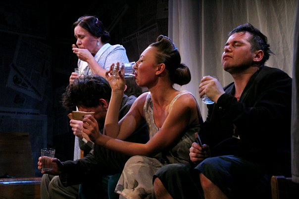

## «Провинциальные анекдоты» в театре «Комедианты»: все не просто так!

**В театре «Комедианты» снова дают Вампилова. Комедия положений из советского прошлого [«Провинциальные анекдоты»][0], заставляет задуматься: а так уж мы изменились за 40 лет?**

Гостиница «Тайга» в городе Белореченск, 1960-е годы. Футбольный болельщик, в номере которого сломалось радио, стучится в дверь соседнего номера, к незнакомой девушке, чтобы дослушать передачу о матче. И тут как тут администратор Калошин, намекающий, что за пребывание вместе молодых в номере надо дать взятку.

### Для любителей ностальгировать по советской жизни

Дальше собственно и начинается первый «Анекдот» - администратор хамски выталкивает непонятливого болельщика из номера, а потом узнает, что тот -- из «Метранпажа». Что такое «Метранпаж» -- что-то из ОБХСС, а может газета или министерство? Страшные догадки и страх за свою шкуру заставляют его вытворять то, на чем собственно и строится комедия.

Честно говоря, я бы отнеслась к этому анекдоту, как к забавному экскурсу в советское прошлое, и только. Если бы не последний монолог Калошина, который совсем запутался -- кто же он сам в этом мире масок? «С одними одно из себя изображаешь, с прочими - другое, и все думаешь, как бы себя не принизить. И не превысить. Принизить нельзя, превысить и того хуже... ».

Жалкий, смешной Калошин благодаря игре актера [Сергея Николаева][1] не вызывает ни капли сочувствия, даже в момент желания начать жить по-новому, которое, впрочем, быстро улетучивается. Советская система как-то не тянет на оправдание. Потому что моральная клетка Калошина -- хоть и далекая, но такая понятная. И сквозь смех, думается -- каждому времени свой «Метранпаж».

Почва для размышления богатая. А получится ли выдавить из себя этот вечный «метранпажевый» страх? Разве у нас в 2010-м меньше страшилок? Тут нужно на другую ступеньку подняться, а это трудно. Ну хотя бы просто посмеяться для начала - и то хорошо.

### Дают - бери?

Вторая история «Двадцать минут с ангелом» - как сеанс психоанализа. Где это видано -- пьяницы просят денег у прохожих на опохмел, клеймя жадных граждан, и вдруг один из них, агроном Хомутов бескорыстно дарит им половину средней зарплаты.

Пока герои, сами же выпрашивавшие денег у прохожих, клеймят и подозревают доброхота ( по-комсомольски честно сыгранного [Виталием Кравченко][2]), ты ищешь и в себе крупицы доверия этой ситуации.

Все это -- как поиск предела собственной циничности. Люди на сцене и противны в своей злобе, но и близки, и извинительны одновременно. Ответ на вопрос «Верить или нет», что Хомутов и правда бескорыстен, не все, ой не все зрители, судя даже по шепоту в зале, решают однозначно. «Все не просто так, все не просто так! Даже любовь!» - кричит уборщица Фаина ([Татьяна Кожевникова][3]). Впрочем, концовка дает выдохнуть и героям, и зрителям.

Но осадочек-то остался. И гложат всю обратную дорогу вопросы: а осталось ли место в этой жизни доверию, правда ли за каждой добротой стоит что-то мелочное, свое? Не верь, не бойся, не проси? И как сохранить человеческое в этой паутине осторожности и лжи самим себе?

«Провинциальные анекдоты» Вампилова вышли на сцену «Современника» в 1974 году. И хотя сейчас, в наш 21 век, режиссер [Алексей Исполатов][4] попытался придать спектаклю легкую нотку ностальгии по советскому быту, тематика, если сдунуть пыль, еще как остра. [«Провинциальные анекдоты»][0], сквозь смех и иронию над «совком», вдруг жестко ставят вопрос: так ли мы свободны и нынче, в век свободы, от самих себя?

В спектакле заняты: [Екатерина Белова][5], [Юлия Горшенина][6],[Татьяна Кожевникова][3], [Екатерина Культина][7], [Анастасия Пижель][8], [Галина Сабурова][9], Светлана Суханова, [Филипп Азаров][11], [Семен Афендулов][12], [Сергей Бледных][13],[Ильгиз Булгаков][14],[Станислав Воронецкий][15], [Анатолий Ильченко][16], [Николай Исполатов][17], [Виталий Кравченко][2], [Сергей Николаев][1].

Газета "Мой район онлайн" / 11.10.2010 г. / Автор: Татьяна Морозова

[Ссылка на статью][18]

[0]: ../../performance/provintsialnye-anekdoty "Провинциальные анекдоты"
[1]: ../../person/sergei-nikolaev "Сергей Николаев"
[2]: ../../person/vitalii-kravchenko "Виталий Кравченко"
[3]: ../../person/tatyana-kozhevnikova "Татьяна Кожевникова"
[4]: ../../person/aleksei-ispolatov "Алексей Исполатов"
[5]: ../../person/ekaterina-belova "Екатерина Белова"
[6]: ../../person/yuliya-gorshenina "Юлия Горшенина"
[7]: ../../person/ekaterina-kultina "Екатерина Культина"
[8]: ../../person/anastasiya-pizhel "Анастасия Пижель"
[9]: ../../person/galina-saburova "Галина Сабурова"
[11]: ../../person/filipp-azarov "Филипп Азаров"
[12]: ../../person/semyon-afendulov "Семён Афендулов"
[13]: ../../person/sergei-blednykh "Сергей Бледных"
[14]: ../../person/ilgiz-bulgakov "Ильгиз Булгаков"
[15]: ../../person/stanislav-voronetskii "Станислав Воронецкий"
[16]: ../../person/anatolii-ilchenko "Анатолий Ильченко"
[17]: ../../person/nikolai-ispolatov "Николай Исполатов"
[18]: http://www.mr7.ru/articles/33937/