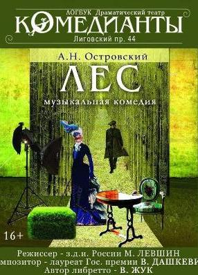
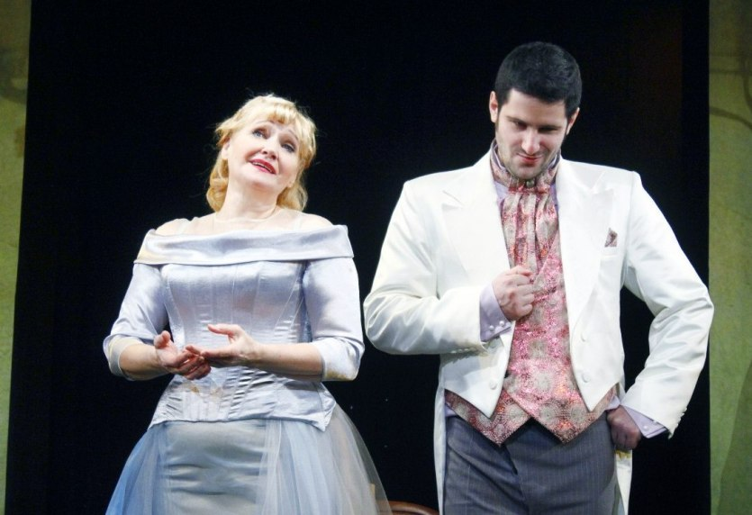
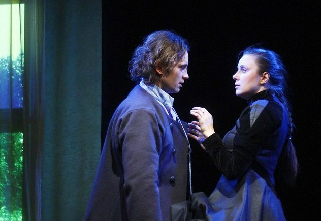

## "В ПЕРВОМ РЯДУ"
Рецензия Людмилы Филатовой на спектакль ЛЕС

[

][0]

Театр обновил не только здание Первая премьера после ремонта в театре «Комедианты» — музыкальная комедия по пьесе А.Н. Островского [«Лес»][0] в постановке [Михаила Левшина][1] — серьёзная заявка на обновление не только здания, но и художественного курса театра. Маленький театр на Лиговке в кругу профессионалов считается консервативным: здесь любят классику, режиссёрские операции над ней всегда осторожны, а роли, напротив, выстраиваются тщательно, в подчёркнуто бенефисной манере а-ля ХIX век. К тому же и размеры зала, и ограниченность бюджета (не секрет, что статус «областных» заставляет несколько петербургских театров не столько жить, сколько выживать) порой не дают возможности воплотить задуманное, отбрасывают вполне достойный коллектив в разряд «провинциальных», «домашних»... Первой ласточкой грядущего обновления стал прошлогодний спектакль [«МуМу»][2] (сейчас [«Крепостная любовь»][2]), серьёзная и глубокая работа, получившая признание в Европе. И вот теперь — [«Лес»][0], гимн актёрской профессии, одна из самых репертуарных пьес «русского Шекспира». Сегодня в Петербурге можно увидеть «Лес» романтический (Театр на Литейном), «Лес» концептуальный (Театр им. Ленсовета), «Всё тот же Лес» (театр «Буфф»)... Привозил нашумевший «Лес» Кирилла Серебренникова МХТ им. Чехова, телеканал «Культура» неоднократно демонстрировал вариант московского Театра Сатиры... Но есть смысл посмотреть и [«Лес»][0] Левшина. Поклонники могут быть спокойны: театр верен себе — никаких отчаянно радикальных преобразований пьеса не претерпела. Сохранена главная коллизия, сюжетные линии, система персонажей, знакомые с детства репризы... Однако жанровое переключение (комедия — музыкальная комедия) оказалось важным предлагаемым обстоятельством для трактовки в целом. При всём уважении к автору, режиссёр выстраивает собственную историю, в которой комизм извлекается не из собственно текста, не из вульгарного «осовременивания» и даже

не из несоответствия текста картинке, а из законов «опереточного» жанра, где есть обязательная примадонна, герой-любовник, простак, наперсница, резонёр... Автором либретто стал Вадим Жук — поэт, гений капустника, человек редкого дарования и поразительного остроумия. Ему удалось сочинить тексты песен, которые тянет назвать «зонгами» в память о театре, которому была небезразлична судьба страны. О музыке Владимира Дашкевича, композитора именитого, напишут специалисты: скажу лишь, что есть несколько мелодий, которые зритель будет напевать про себя, обдумывая спектакль по дороге домой. В итоге [«Лес»][0] Левшина, с его абсурдистскими куплетами и ариями, во многом ближе каноническому жанру комедии, чем драматургический оригинал.

На сцене (художник Полина Левшина) — простенький, приблизительный антураж условной «гостиной»: столик с резными ножками, кресло, две «старинные» люстры. Справа — чучела лесных животных, слева — вешалка для костюмов. Не сразу видишь четыре экрана за лёгкими занавесками: а на них то вспыхивает манящая зелёная рощица, то падают осенние листья,то сдержанно улыбаются натурщицы. Но Гурмыжской ([Нина Мещанинова][3]) вообще не важно оформление сцены. Главное для неё — эффектный выход («Раиса Павловна Гурмыжская!» — торжественно объявляет верный старый помреж Карп (Юрий Агейкин). У [Нины Мещаниновой][3], известной петербуржцам исполнительницы романсов, очень выразительный, сильный, красивый голос. Тем страннее, как могла её героиня, эта взрослая, талантливая, пышно и роскошно одетая (смена туалетов предусмотрена неоднократно) женщина всерьёз увлечься мальчишкой Алексисом?! Андрей Вергелис («Этюд-театр») точнейшим образом играет сегодняшнего хипстера, завсегдатая кофеен с зоной Wi-Fi, постепенно превращающегося в условного Галкина, обнаглевшего от успеха, но катастрофически несвободного. Линия Аксюши — Петра сыграна, к сожалению, не так интересно, но это не вина молодых актёров [Юлии Бурцевой][4] и [Виталия Кравченко][5]. Однозначно положительные роли самые трудные. Блестящий же дуэт Несчастливцев — Счастливцев (Андрей Шимко — [Сергей Николаев][6]) заслуживает отдельного разбора, не в рамках газетной рецензии...

Пьеса Островского не стала для театра «Комедианты» ни материалом для прямого социального анализа, ни поводом для модного эксперимента. Но спектакль определённо обозначил действительный этап на пути к остросовременному, актуальному и прежде всего человечному театру.

Автор рецензии: Людмила Филатова

февраль 2013 / автор: Л.Филатова

[0]: ../../performance/les "Лес"
[1]: ../../person/mikhail-levshin "Михаил Левшин"
[2]: ../../performance/krepostnaya-lyubov-mumu "Крепостная любовь (Муму)"
[3]: ../../person/nina-meschaninova "Нина Мещанинова"
[4]: ../../person/yuliya-burtseva "Юлия Бурцева"
[5]: ../../person/vitalii-kravchenko "Виталий Кравченко"
[6]: ../../person/sergei-nikolaev "Сергей Николаев"